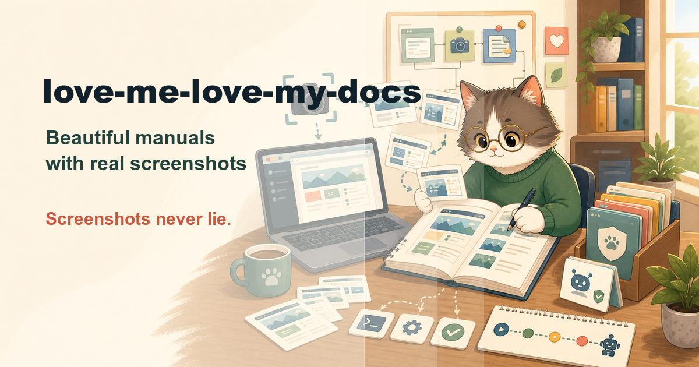

# love-me-love-my-docs

**Auto-generate a beautiful user manual whose screenshots never lie —
because they're captured by code, not pasted by hand.**

`love-me-love-my-docs` is an [agent skill](https://vercel.com/docs/agent-resources/skills)
for the manual nobody wants to write and everybody needs. Manuals rot for
one reason: screenshots are pasted, so the day the UI changes, every image
lies. This skill makes screenshots a **build artifact** — a committed
capture script walks the real app and shoots every step — so regenerating
the entire manual is one command, forever.

## What it does

```
/love-me-love-my-docs . platform: web, output: mkdocs, language: th
```

1. **Flow census** — user journeys mined from routes and navigation
   (`file:line` each), turned into a chapter plan you approve first.
2. **Demo data hygiene** — a seeded fictional account; **zero real user
   data in any frame** (screenshots outlive databases — treat every one
   as public forever).
3. **Capture harness** —
   - **Web:** [Playwright](https://playwright.dev/python/) (Python):
     stored auth state, pinned viewport/theme, animation-freezing,
     target-element highlighting, per-locale runs.
   - **Mobile:** [Maestro](https://maestro.dev/) — one YAML flow with
     `takeScreenshot` runs on iOS **and** Android; Fastlane
     snapshot/screengrab for store-screenshot sets; honest degraded mode
     (flows + manual checklist) when no simulator is available.
4. **The manual** — chapter per flow: goal, prerequisites, numbered steps
   with one screenshot each (captions say what to *notice*), result,
   troubleshooting from real failure modes. Written in user language —
   "click **Publish**", never "trigger the endpoint".
5. **Beautiful output** — MkDocs Material by default (brand color pulled
   from the product's actual CSS), or plain Markdown, or PDF — one source,
   never forked per format.
6. **Freshness contract** — capture scripts are committed
   (`docs/capture/`); the manual documents its own regeneration command;
   recommended CI job makes a UI change that breaks capture fail loudly
   instead of letting the manual rot silently.

Bonus: steps the harness can't automate usually mean missing
`data-testid`s or accessibility labels — reported as app findings, because
they hurt real users and QA too, not just docs.

## The skill family

| Skill | Moment |
|-------|--------|
| [know-my-repo](https://github.com/silkyland/know-my-repo) | Day one: onboard onto a repo with zero knowledge |
| [deep-plan](https://github.com/silkyland/deep-plan) | Plan the next feature/refactor — evidence-gated |
| [deep-plan-ingest](https://github.com/silkyland/deep-plan) | Distill an accepted plan into living knowledge files |
| [clean-slate](https://github.com/silkyland/clean-slate) | Reset rotten knowledge files — backup-gated |
| [transform-my-repo](https://github.com/silkyland/transform-my-repo) | Change the architecture: migration feasibility + strategy |
| [twin-my-site](https://github.com/silkyland/twin-my-site) | Extend the web product with a native mobile twin |
| [jury-my-repo](https://github.com/silkyland/jury-my-repo) | Multi-agent adversarial audit with a verified verdict |
| **love-me-love-my-docs** | A user manual that regenerates itself |

Shared law: **no claim without evidence** — here: no screenshot without a
script that reproduces it, no documented step that wasn't actually
performed.

## Install

```bash
npx skills add silkyland/love-me-love-my-docs
```

Or copy this directory into your agent's skills folder
(e.g. `~/.claude/skills/love-me-love-my-docs/`).

## Structure

```
love-me-love-my-docs/
├── SKILL.md                          # 7-step workflow + reproducibility rules
└── references/
    ├── capture-web.md                # Playwright (Python) harness patterns
    ├── capture-mobile.md             # Maestro flows + Fastlane/simctl/adb alternatives
    └── manual-structure.md           # Manual anatomy, writing rules, MkDocs Material/PDF rendering
```

Follows the [Vercel skills](https://github.com/vercel-labs/skills) single-skill
layout and [Anthropic's skill authoring best practices](https://platform.claude.com/docs/en/agents-and-tools/agent-skills/best-practices).

## License

MIT
